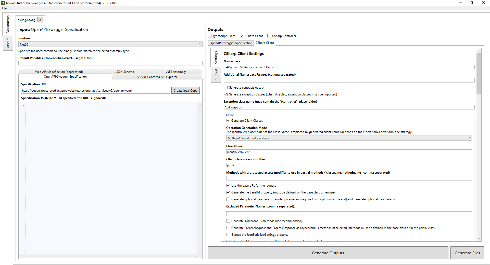

# Code generation

## Tools

There are number of tools you can use to generate client code from REST API specification. One of them is NSwagStudio

### NSwagStudio

You can download and find detailed documentation in [NSwagStudio web site](https://github.com/RicoSuter/NSwag/wiki/NSwagStudio).



You can adjust configured code to your needs. Some suggestions:

1. Set your Namespace (in our example it is *B4Payment.SEPAexpress.Client.Demo*)
1. In JSON Serialization section unselect *Required properties must be defined in JSON (set Required.Always when property is required)*

#### NSwagStudio step-by-step code generation instructions

1. In *Input -> Specification URL:* enter REST API specification yaml, e.g.:
   *<https://sepaexpress-prod-fx.azurewebsites.net/openapi/services/v2/openapi.yaml>*
1. In *Input -> Runtime* select required .net version e.g.: *Net60*
1. In *Outputs* select *CSharp Client* checkbox
1. Set *Namespace* of for the generated classes
1. Press the big button *Generate Outputs*
1. In the *Output* window you can select generated code and paste it into you code
1. Because there is a bug in NSwagStudio you need to fix the generated code.    Instead of improper statement ```return default(void);``` you need to write proper statement: ```return;```.

You need to repeat steps above for Authorization API, URL e.g.: *<https://sepaexpress-prod-fx.azurewebsites.net/openapi/identity/v1/openapi.yaml>*. In that case you should enter another *Namespace* that stated above.

